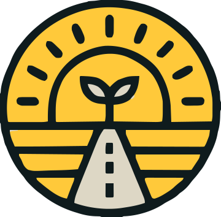

 

----

  
Contribution Graph

  <samp>
   
  <h2 align="center"> </h2>
  
   
  </samp>

<h1 style="color: #fff; font-family: 'Fira Code', monospace; font-size: 22px; margin: 10px;">Find me here:</h1>

   

